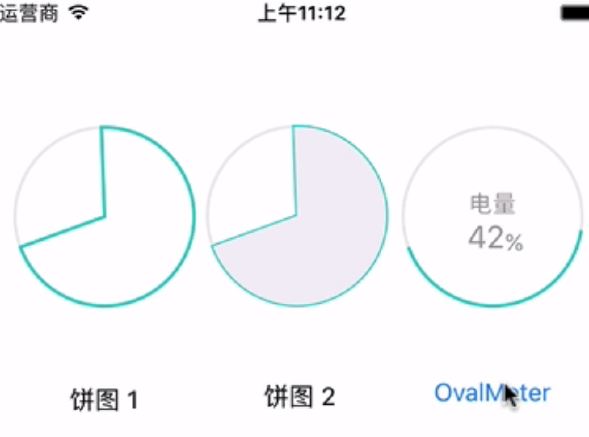
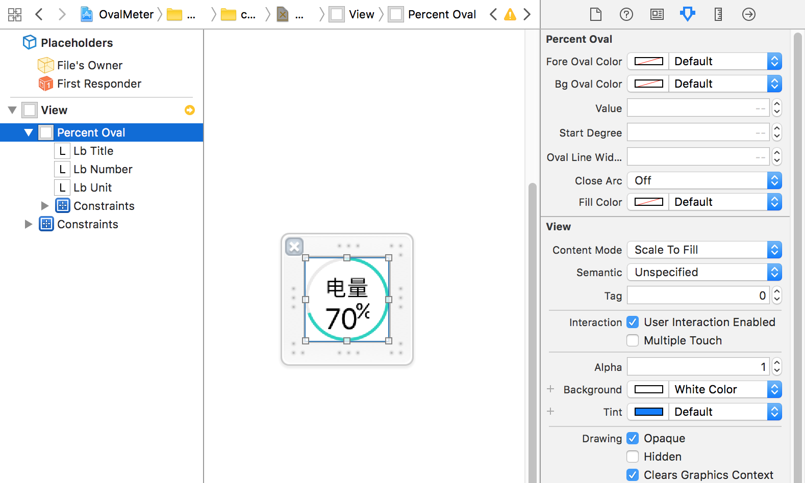

#饼图控件

一个饼图控件，可以饼图方式显示 0-1 之间的数值。同时支持自定义以及以动画方式显示：

##用法
将如下文件导入到您的项目中：

* PercentOval.h/.m
* OvalMeter.h/.m/.xib

根据需要在你的源文件中导入对应的头文件。

### PercentOval

PercentOval 用于绘制基本的饼图控件。它支持 IB 的可视化设计。在故事板中拖入一个 UIView，在属性面板中，设置其 Class 为 PercentOval。

在属性面板中，你可以通过如下属性定制 Ammeter 控件：

* @property(strong,nonatomic)IBInspectable UIColor* foreOvalColor;
* @property(strong,nonatomic)IBInspectable UIColor* bgOvalColor;
* @property(assign,nonatomic)IBInspectable CGFloat value;// between 0-1
* @property(assign,nonatomic)IBInspectable CGFloat startDegree;
* @property(assign,nonatomic)IBInspectable CGFloat ovalLineWidth;
* @property(assign,nonatomic)IBInspectable BOOL closeArc;// 封闭弧
* @property(strong,nonatomic)IBInspectable UIColor* fillColor;// 弧的填充色

其中：

* foreOvalColor 和 bgOvalColor: 设置饼的外弧颜色，前者表示 value 值所占的份额（百分比），后者表示背景绘制的圆圈颜色（整个圆）。
* value : 设置绘制的弧占正圆的百分比（取值范围 0-1 之间）。
* Default Color : 设置空的刻度线的默认颜色（图中用于表示已用掉的电量）。
* startDegree : 设置绘制弧的起始角度，默认为 160 度。弧的绘制方向为反时针方向。
* ovalLineWidth : 弧线的宽度，默认为 2 个像素。
* closeArc : 是否封闭弧，默认不封闭，则绘制的是一个光滑弧线，如果要绘制饼图，则需要设置为 YES，并允许填充颜色。
* fillColor : 如果绘制饼图，此颜色指定填充颜色。

### OvalMeter

OvalMeter 类用于绘制圆弧图，并支持动画展示（调用 startAnimating 方法）。它在 PercentOval 的基础上加入了一些文字标签。如果你需要定制这些标签的布局和样式，可以编辑 OvalMeter.xib。

## 示例程序

用 Xcode 8 打开 OvalMeter.xcodeproj，在模拟器中运行以查看效果。

有任何问题和建议，请与[作者](kmyhy@126.com)联系。